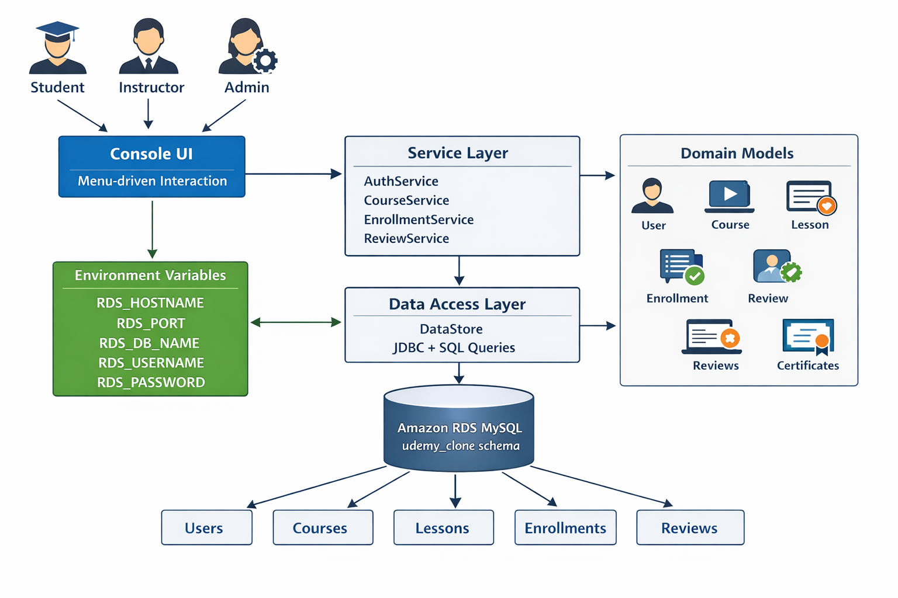

# Udemy Clone - Java Console App

A console-based learning platform built with Java and Amazon RDS MySQL.

## Architecture



## Features

- User roles: Student, Instructor, Admin
- Course creation and management
- Enrollment and progress tracking
- Reviews and ratings
- Certificates on completion

## Requirements

- Java 17+
- MySQL Connector/J 8.0.33
- Amazon RDS MySQL (or local MySQL)

## Quick Start

### 1. Setup Database

Run the schema on your RDS instance:
```bash
mysql -h your-rds-endpoint.rds.amazonaws.com -u admin -p udemy_clone < schema.sql
```

### 2. Run the App

```powershell
cd UdemyCloneJava

# Set credentials
$env:RDS_HOSTNAME = "your-rds-endpoint.rds.amazonaws.com"
$env:RDS_USERNAME = "admin"
$env:RDS_PASSWORD = "your-password"

# Compile and run
javac -encoding UTF-8 -cp ".;mysql-connector-j-8.0.33.jar" UdemyClone.java
java -cp ".;mysql-connector-j-8.0.33.jar" UdemyClone
```

On Linux/Mac use `:` instead of `;` in classpath.

## Default Admin

- Email: `admin@udemy.com`
- Password: `Admin@123`

## Project Files

```
UdemyCloneJava/
  UdemyClone.java         # Main application (single file)
  schema.sql              # Database schema
  mysql-connector-j-8.0.33.jar  # JDBC driver
  README.md
```

## How It Works

**Students** can browse courses, enroll, track progress, and earn certificates.

**Instructors** can create courses, add lessons, and view stats.

**Admins** can approve courses, manage users, and view analytics.

## Environment Variables

| Variable | Default | Description |
|----------|---------|-------------|
| RDS_HOSTNAME | localhost | Database host |
| RDS_PORT | 3306 | Database port |
| RDS_DB_NAME | udemy_clone | Database name |
| RDS_USERNAME | root | Database user |
| RDS_PASSWORD | (empty) | Database password |

## Troubleshooting

**Can't connect to database:**
- Check RDS security group allows port 3306
- Verify RDS is publicly accessible
- Confirm endpoint URL is correct

**Class not found error:**
- Make sure you're in the UdemyCloneJava folder
- Verify mysql-connector JAR is in the same folder

## License

MIT
